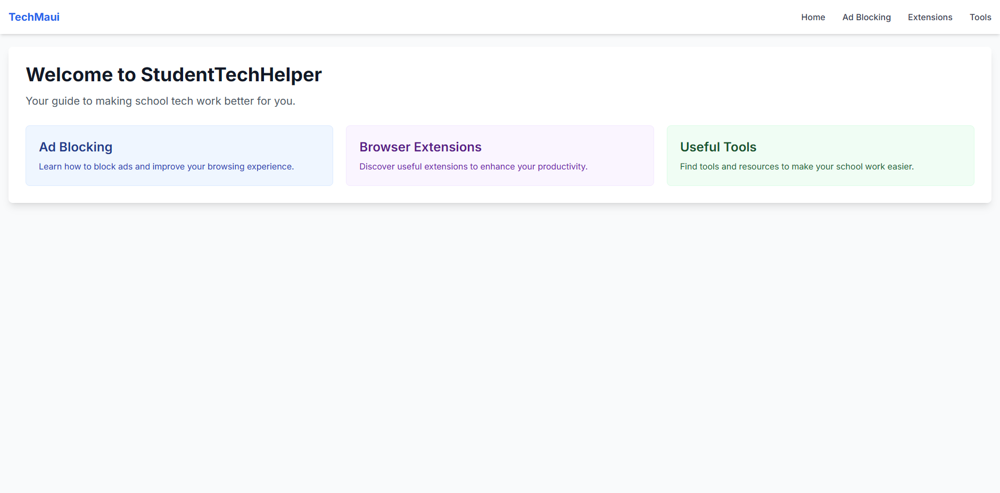
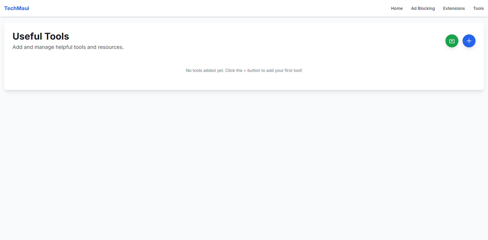

# TechMaui

TechMaui is a web application designed to help students navigate common technical challenges and improve their digital experience. The platform provides easy-to-follow guides for essential tools like ad blocking, along with a curated collection of educational resources.

## 🖼️ Screenshots

### Home Page

*Add a screenshot of your home page showing the main cards and layout*

### Tools Page

*Add a screenshot of your tools page showing the grid layout and ad blocking indicators*

## 🚀 Features

- **Ad Blocking Guide**: Step-by-step instructions for installing and using uBlock Origin
- **Resource Management**:
  - Add and organize useful tools and websites
  - Custom image and description support
  - Website preview generation
  - Ad blocking requirement indicators
  - Local storage for persistent data
- **Modern UI/UX**:
  - Responsive design for all devices
  - Clean and intuitive interface
  - Interactive cards and animations
  - Color-coded sections for easy navigation

## 🛠️ Built With

- **Frontend**: React.js
- **Styling**: Tailwind CSS
- **Routing**: React Router
- **State Management**: React Hooks
- **Storage**: LocalStorage
- **Development**: Vite

## 📋 Prerequisites

Before you begin, ensure you have the following installed:
- Node.js (v14 or higher)
- npm (v6 or higher)

## 🔧 Installation

```bash
# Clone the repository
git clone https://github.com/nxtcarson/techmaui.git

# Navigate to project directory
cd techmaui

# Install dependencies
npm install

# Start development server
npm run dev

# Open in browser
http://localhost:5173
```

## 🚀 Deployment

### Local Build
```bash
# Create production build
npm run build

# Preview production build locally
npm run preview
```

### Deploy to GitHub Pages
```bash
# Update vite.config.js base URL
# Add this to your vite.config.js:
# export default defineConfig({
#   base: '/techmaui/',
#   // ... other config
# })

# Build the project
npm run build

# Deploy to GitHub Pages
npm run deploy
```

### Deploy to Vercel
```bash
# Install Vercel CLI
npm i -g vercel

# Deploy to Vercel
vercel

# Deploy to Production
vercel --prod
```

### Deploy to Netlify
```bash
# Install Netlify CLI
npm install netlify-cli -g

# Deploy to Netlify
netlify deploy

# Deploy to Production
netlify deploy --prod
```

## 🤝 Contributing

1. Fork the repository
2. Create your feature branch (`git checkout -b feature/AmazingFeature`)
3. Commit your changes (`git commit -m 'Add some AmazingFeature'`)
4. Push to the branch (`git push origin feature/AmazingFeature`)
5. Open a Pull Request

## 📝 License

This project is licensed under the MIT License - see the [LICENSE](LICENSE) file for details.

## 🙏 Acknowledgments

- [Tailwind CSS](https://tailwindcss.com/) for the utility-first CSS framework
- [React](https://reactjs.org/) for the frontend library
- [Vite](https://vitejs.dev/) for the build tool and development server
- [thum.io](https://www.thum.io/) for website preview generation 